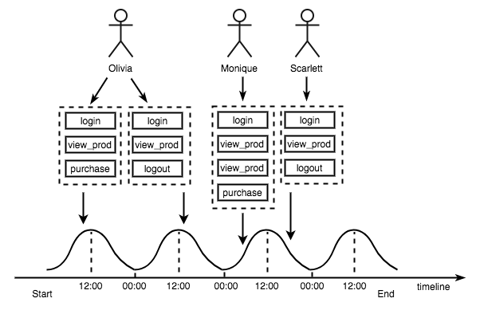
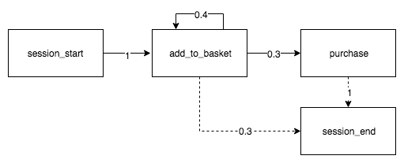

## Genesis

### Motivation
Create a data generator, which easily generates fake but realistic customer behaviour data based on custom trends you declare.

### Installation
```bash
npm install --save genesis-library
```

### Use cases
This tool is great for **onboarding** or **demos**.
For example, lets say you want to generate data for January 2016 - April 2016. You can easily specify 1000 customers, aged 20-30, with a events described by purchase flow.

### Introduction
Generator creates customers, **uniformly distributed** across the whole time range and to each it assigns sessions which are probabilistic sequences of events separated by some time. These events are **normally distributed** throughout the day with a mean (e.g. 3PM) and standard deviation (e.g. 3hrs) that you can define yourself. The output would look something like this:



The key concept to understand is **session**. The session is a probabilistic state machines, from which generator calculates what event comes next. Example of a purchase session might look like this:



The numbers indicate probability of moving between events. The crossed line indicated that the transition is made implicitly if probabilities do not add up to 1.

### Requirements for the generator
These are the key requirements which the generator must fulfil.

1. For each session generate **new events** probabilistically calculated.

2. For each of the events in session generate **new** event attributes.

3. Independent events within a session (e.g. "add to basket" and "purchase" on diagram) can have **linked** attributes.

### API Documentation
`genesis-library` exports a single class `Generator`. This generator takes as an argument a definition file, which a dictionary describing the whole data generation process.

```javascript
const definition = {
	"settings": {
		"startTimestamp": 1514764800, // Required. Start time for generation.
		"endTimestamp": 1530403200, // Requied. End time for generation.
		"retention": [0.6, 0.3, 0.3], // Required. Probability of customer having another session.
		"sessionMean": 12, // Optional, defaults to 12. Mean around which events will be normally distributed throughout the day.
		"sessionStd": 300000, // Optional, defaults to 1000*60*60*24/4. Standard deviation for events generation.
		"nextSessionDaysMin": 5, // Optional, defaults to 3. Minimal number of days after which another session is created.
		"nextSessionDaysMax": 7, // Optional, defaults to 10. Maximal number of days after which another session is created.
		"eventsSeparationTime": 100000, // Optional, defaults to 30000. Maximal number of milliseconds between two events.
	},
	"flows": [
		{
			"name": "purchaseFlow", // Optional, default to "Unnamed flow". Name of the Flow.
			"startNode": "4", // Required. ID of the starting Node.
			"exitNode": "2", // Required. ID of the ending Node.
			"nodes": [ // Optional defaults to [].
				{
					"id": "1", // Required.
					"type": "action", // Required. Has to be either action, customer_update, condition or event.
					"attributes": { // Required.
						"definition": "session.id = 42; session.cart = [{id: 1},{id: 2},{id: 3}];" // Required. JavaScript code to execute.
					}
				},
				{
					"id": "2",
					"type": "condition",
					"attributes": { // Required.
						"definition": "{{ session.id == 42 }}" // Required. JavaScript/Jinja code returning boolean.
					}
				},
				{
					"id": "3", // Required.
					"type": "event", // Required.
					"attributes": { // Required.
						"name": "blank_event" // Optional, defaults to id.
					}
				},
				{
					"id": "4", // Required.
					"type": "event", // Required.
					"attributes": { // Required.
						"name": "view_item", // Optional, defaults to id.
						"resourcesDefinitions": { // Optional, defaults to {}.
							"catalog": "{{ catalog }}",
							"sale_name": "Black Friday Sale!",
							"discounts": "{ 'student': 50, child: 60, adult: 0 }"
						},
						"attributesDefinitions": { // Optional, defaults to {}.
							"item_id": "{{ resources.sale_name }}",
							"item_name": "{{ customer.name }}",
							"item_x": "{{ RANDOM(catalog) }}"
						},
						"pageVisit": { // Optional, defaults to { enabled: false }.
							"enabled": false,
							"attributesDefinitions": {
								"url": "shop.com/product?id={{ resources.sale_name }}",
								"referrer": "{{ customer.name }}",
								"browser": "{{ session.browser ",
								"device": "{{ session.device }}",
								"os": "{{ session.os }}"
							}
						},
						"repetition": { // Optional, defaults to { enabled: false }.
							"type": "iterative",
							"enabled": false,
							"attributes": {
								"iteratorDefinition": "{{ session.cart | safe }}"
							}
						}
					}
				}
			],
			"transitions": [ // Optional, defaults to [].
				{ "source": "4", "destination": "2", "probability": 1 }
			]
		}
	],
	"customers": [ // Optional, defaults to [].
		{ "ids": { "registered": "x" }, "attributes": { "name": "Lukas", "surname": "Cerny" } }
	],
	"catalog": [ // Optional, defaults to [].
		{ "item_id": "1", "item_name": "Socks" }
	]
};
const Genesis = require("genesis-library");
const generator = Genesis.Generator(definition);
const customers = generator.createCustomers();
customers.forEach((customer) => {
    generate.createSessions(customer);
})
```
